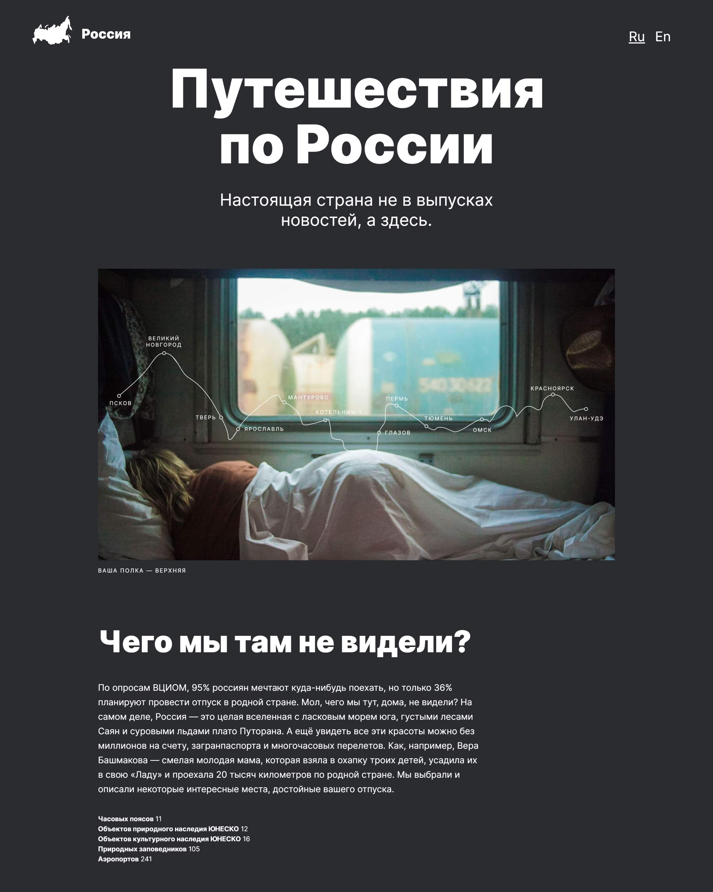

# Проект 3: Путешествие по России

### Обзор
* Интро
* Figma
* Картинки

**Что это?**

Это [страница](https://danilshvalov.github.io/russian-travel/), которая рассказывает о невероятных местах для путешествия по России. 

---

**Использованные технологии**

* Вёрстка по макету в [Figma](https://www.figma.com/file/OyRWEjU6wBwRe1hapzQoLx/Sprint-3%3A-Russia-%2F-desktop-%2B-mobile?node-id=28503%3A0)
* Grid Layout
* Flex-контейнеры
* Пвсевдоклассы
* Методология БЭМ
* Адаптивные шрифты
* Отзывчивые контейнеры
* Медиа-запросы
* Использование веток в Git

